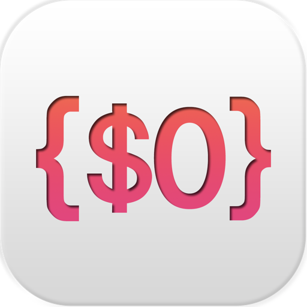
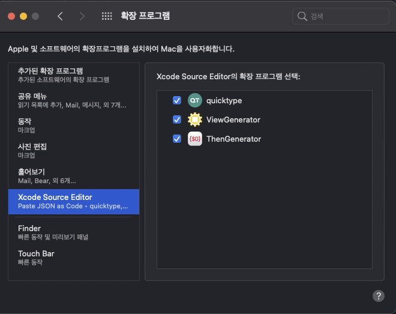
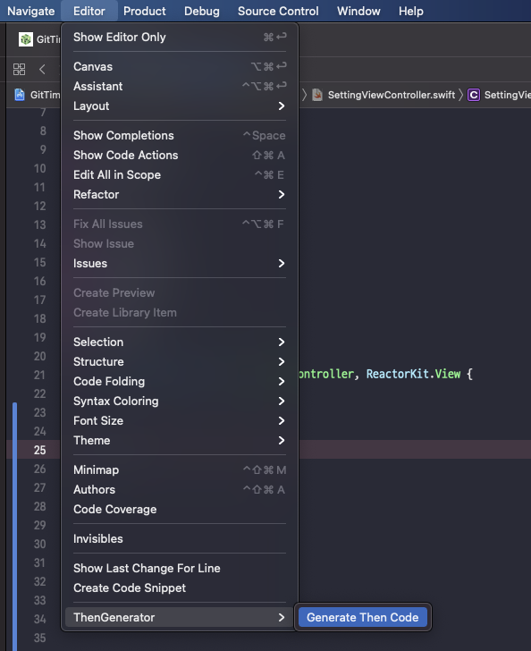
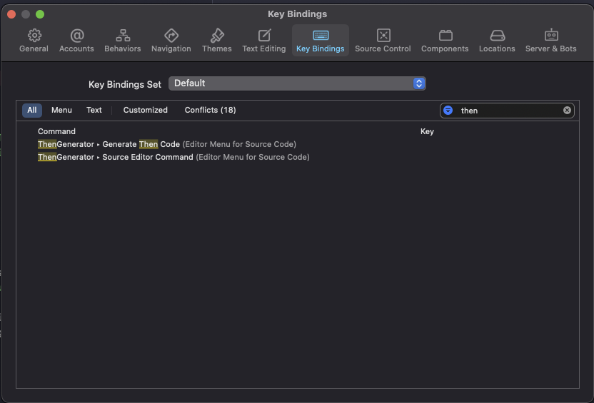
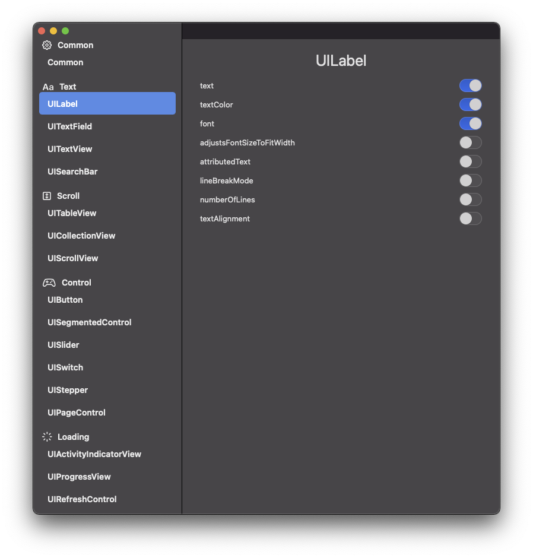

# ThenGenerator

## Overview

ThenGenerator is Xcode Source Editor Extension for [Then](https://github.com/devxoul/Then)

## Install

## Enviroment

- macOS 11.0 (Big Sur)
- SwiftUI
- UserDefaults

## How to use

1. Install ThenGenerator
2. Enable Xcode Source Editor

   - `` -> `System Preferences` -> `Extensions`
   - Check `ThenGenerator`

   

3. Input variable name for Generate code. Without `UI` prefix.
4. If you want to create a UILabel class with variable name `repoNameLabel`, you input text `VariableName + Label`
5. Select variable name
6. `Editor` -> `ThenGenerator` -> `Generate Then Code`

   

## Use Shortcut

1. Xcode Preferences.. (`⌘` + `,`)
2. Key Bindings
3. Search ThenGenerator
4. Add Shortcut

## Change Properties

1. Launch `ThenGeneratorApp`
2. Find `UIKit` class and turn on/off switch

## Demo

<table>
<tr>
<th>Single</th>
<th>Multiline</th>
</tr>
<td>

</td>
<td>

</td>

</table>

## Contribution

If you find a bug or want to add a new property, find `XXXXModel.swift` in Models Folder and fix or append property.
And find `XXXXComponent.swift` in ComponentViews Folder and add `SwitchView` with new property.

## References

- [ViewGenerator](https://github.com/funzin/ViewGenerator)
